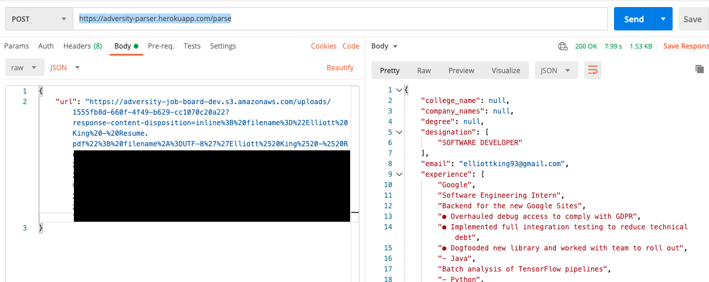

# Adversity Board Resume Parser
A service I created to parse resumes for me. Send a POST request a pdf url, and this will parse the resume for you. Built with Flask on Heroku.

# Background
I have a webapp that is a silly job board, and makes fun of you. In one section, it intentionally misspells your resume. I am using this endpoint to do the initial (correct) parsing.

My project is in Ruby on Rails, but Python has a great deal of open source projects involving machine learning & data science. I found the [pyresparser](https://github.com/OmkarPathak/pyresparser) library, and decided to use it to parse my resumes. My Rails app is on Heroku, and saves the pdfs to Amazon S3. I created this service to handle the actual parsing. 

If you send a POST to the service with the url of your resume (pdfs only), this will return the output of pyresparser.

# Running locally
Clone down the repo, and then follow the official [Flask](https://flask.palletsprojects.com/en/1.1.x/) directions to set up a python venv. You can then use `pip install -r requirements.txt` to install the dependencies. Then, install the nltk corpus that pyresparser needs with `python -m nltk.downloader words && python -m nltk.downloader stopwords`. Finally, make sure to `set FLASK_APP=app.py`, and you can then run it with Flask.

# Useful Resources
- [pyresparser](https://github.com/OmkarPathak/pyresparser)
- [Flask on Heroku guide](https://stackabuse.com/deploying-a-flask-application-to-heroku/)
- [Including NLTK in Heroku](https://devcenter.heroku.com/articles/python-nltk)
- [Including specific spaCy models](https://spacy.io/usage/models#models-download)